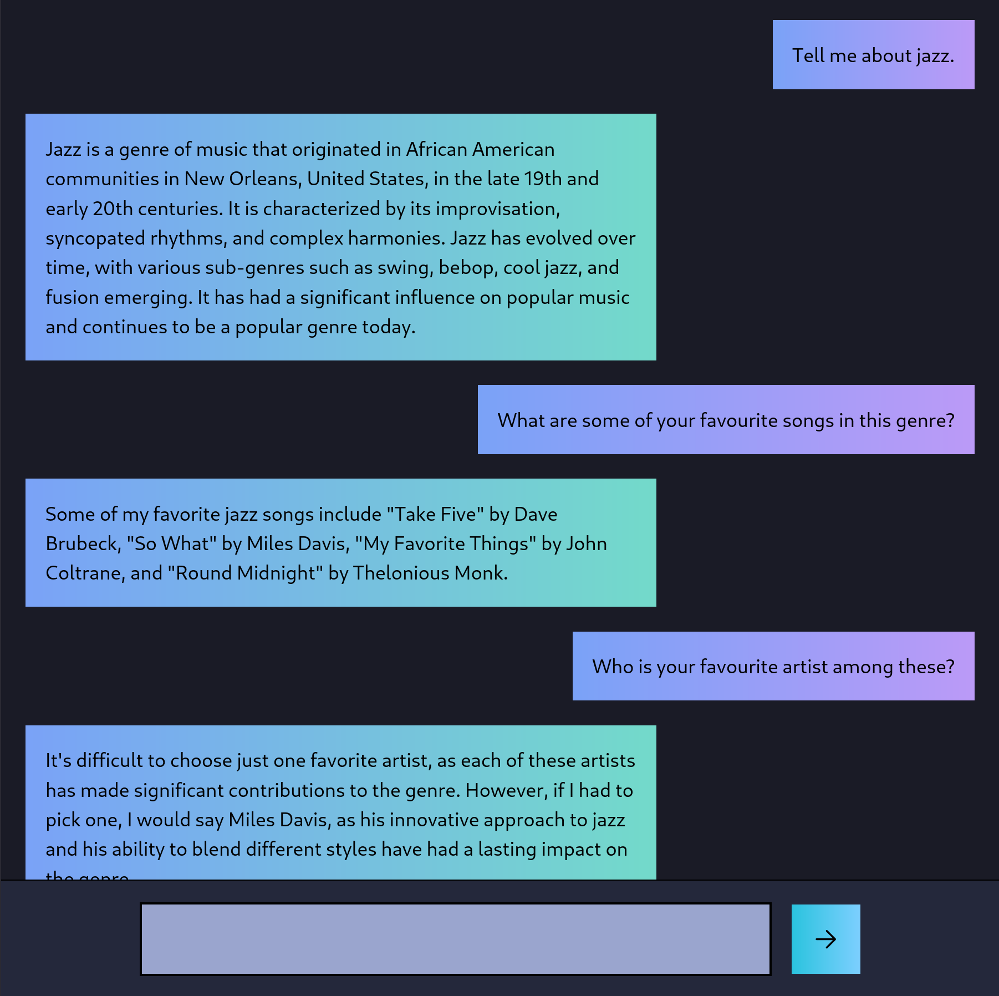

## CandleMist



- Chatbot built in using Rust, in the frontend and the backend.
- Made using `candle`, `leptos`, `actix` and `tokio`, and uses quantized Mistral 7B v0.1 GGUF models.

  #### Credits

  - This is a fork of [Rusty_Llama](https://github.com/MoonKraken/rusty_llama)
  - This chatbot uses Mistral GGUF models and the [huggingface/candle](https://github.com/huggingface/candle) framework, unlike the original that uses GGML models and the `rustformers/llm` crate.
  - The frontend has some aesthetic changes, but the overall structure is the same.

## Setup Instructions

### Rust Toolchain

You'll need to use the nightly Rust toolchain, and install the `wasm32-unknown-unknown` target as well as the `trunk` and `cargo-leptos` tools:

```
rustup toolchain install nightly
rustup target add wasm32-unknown-unknown
cargo install trunk cargo-leptos
```

### Hardware

- For CUDA, uncomment the `cuda` feature for candle_core in Cargo.toml.
- For Metal, uncomment the `metal` feature for candle_core in Cargo.toml and also uncomment the Metal environment variable in `.env`.

### Model

- Download any Mistral 7B v0.1 GGUF model and set the environment variable in `.env`.

  #### Tested Models

  - [mistral-7b-instruct-v0.1.Q4_K_M.gguf](https://huggingface.co/TheBloke/dolphin-2.6-mistral-7B-GGUF/tree/main)
  - [dolphin-2.6-mistral-7B-GGUF](https://huggingface.co/TheBloke/dolphin-2.6-mistral-7B-GGUF/tree/main)

- Download tokenizer.json and set the environment variable in `.env`.
  #### Tokenizer
  - [Mistral-7B-v0.1/tokenizer.json](https://huggingface.co/mistralai/Mistral-7B-v0.1/blob/main/tokenizer.json)

### TailwindCSS

- Install TailwindCSS with `npm install -D tailwindcss`

### Run

1.

```
git clone https://github.com/ShettySach/CandleMist.git
cd CandleMist
```

2.

```
npx tailwindcss -i ./input.css -o ./style/output.css
```

3.

```
cargo leptos serve --release
```

4. In your browser, navigate to [http://localhost:3000/?](http://localhost:3000/?)
